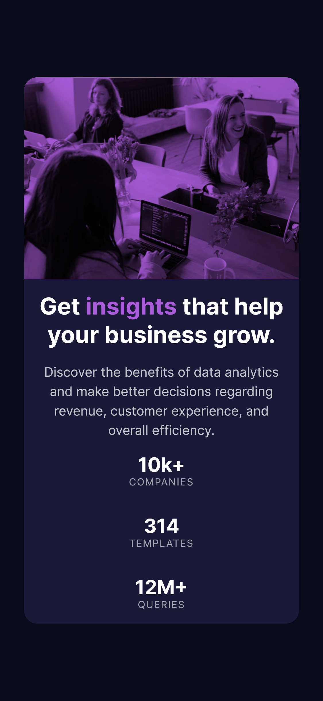

# Frontend Mentor - Stats preview card component solution

This is a solution to the [Stats preview card component challenge on Frontend Mentor](https://www.frontendmentor.io/challenges/stats-preview-card-component-8JqbgoU62). Frontend Mentor challenges help you improve your coding skills by building realistic projects. 

## Table of contents

- [Overview](#overview)
  - [The challenge](#the-challenge)
  - [Screenshot](#screenshot)
  - [Links](#links)
- [My process](#my-process)
  - [Built with](#built-with)
  - [What I learned](#what-i-learned)
  - [Useful resources](#useful-resources)
- [Author](#author)

## Overview

### The challenge

Users should be able to:

- View the optimal layout depending on their device's screen size

### Screenshot

### Links

- Solution URL: [https://github.com/antoinegatelier/frontend-mentor-stats_preview_card_component](https://github.com/antoinegatelier/frontend-mentor-stats_preview_card_component)
- Live Site URL: [https://mystifying-villani-9f3e3f.netlify.app/](https://mystifying-villani-9f3e3f.netlify.app/)

## My process

### Built with

- Semantic HTML5 markup
- CSS custom properties
- Flexbox
- CSS Grid
- Mobile-first workflow

### What I learned

I focused on working with `:root`, `:is`, variables and `calc()`, as I read about these and never used them until now.

### Useful resources

- [MDN Web Docs](https://developer.mozilla.org/fr/) - The reference when it comes to looking up a property, method, etc.

## Author

- Website - [Antoine Gatelier - github](https://github.com/antoinegatelier)
- Frontend Mentor - [@antoinegatelier](https://www.frontendmentor.io/profile/antoinegatelier)
